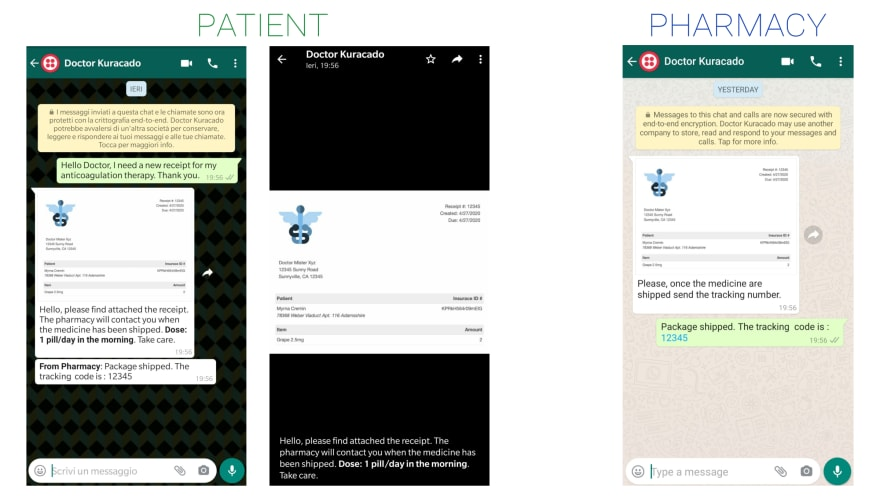
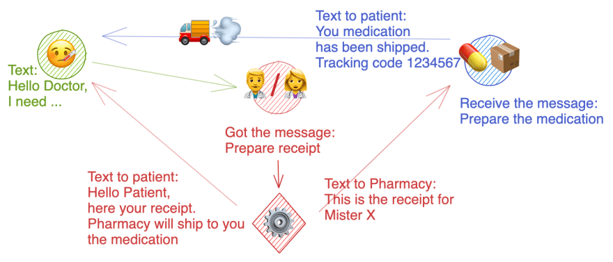
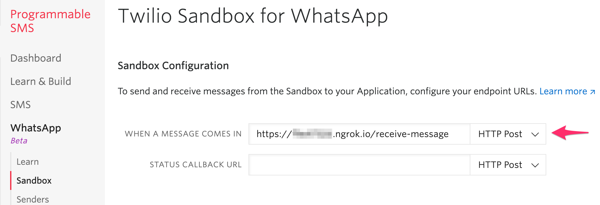
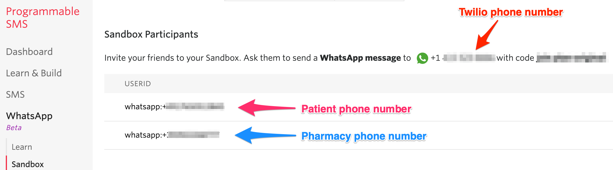

# Kurakado

Helping patients to get their medicine. Project for Dev.to - Twilio hackathon.

## About

Its goal is to facilitate the process of getting the receipt from the doctor and sequentially getting the medicine from the pharmacy.

Kuracado offers a dashboard through which the doctor can communicate and put in communication, the patients, and the pharmacy. It offers also a shipping monitoring when for when the pharmacy sends the medicine to the patient.

### How it works

This application is a demo that assumes the existence of an actual database containing all the data regarding the actors involved in the system.

Every time a user sends a message to the WhatsApp Sandbox, the webhook is called and the server collects the data.
The application uses the AJAX polling technique to continuously fetch new messages from the server.

Once the receipt is ready and transformed from HTML code to an image, is sent to both the patient and the pharmacy. The pharmacy then after has prepared the medicine, texts the patient with the package's tracking code.



Since only one WhatsApp Sandbox is available, and all the users are registered in the same sandbox; the message from the pharmacy to the patient is passing through the doctor that works as an interceptor.
This way the messages received by the pharmacy will not be registered but just forwarded to the patient.

<!--
**TODO: UML Diagram**

We can render UML diagrams using [Mermaid](https://mermaidjs.github.io/).


**TODO: Describe how it works**
-->



## Features

- Dashboard to visualize incoming messages in realtime
- Form to build the receipt
- Monitor on the pharmacy shipment
- Node.js web server using [Express.js](https://npm.im/express)
- Web user interface using [Vue](https://npm.im/vue) along with [Bootstrap Vue](https://npm.im/vue) for the UI components
- Linting and formatting using [Prettier](https://npm.im/prettier)
- Interactive configuration of environment variables upon running `npm run setup` using [`configure-env`](https://npm.im/configure-env)
- Project specific environment variables using `.env` files and [`dotenv-safe`](https://npm.im/dotenv-safe) by comparing `.env.example` and `.env`.

## Set up

### Requirements

- [Node.js](https://nodejs.org/)
- A Twilio account - [sign up](https://www.twilio.com/try-twilio)

### Kuracado Settings

Before we begin, we need to collect all the config values we need to run the application:

| Config&nbsp;Value         | Description                                                                                                                                                              |
| :------------------------ | :----------------------------------------------------------------------------------------------------------------------------------------------------------------------- |
| Twilio account&nbsp;Sid   | Your primary Twilio account identifier - find this [in the Console](https://www.twilio.com/console).                                                                     |
| Twilio auth&nbsp;Token    | Used to authenticate - [just like the above, you'll find this here](https://www.twilio.com/console).                                                                     |
| Twilio phone&nbsp;number  | A phone number for the WhatsApp sandbox [E.164 format](https://en.wikipedia.org/wiki/E.164) - you can [get it here](https://www.twilio.com/console/sms/whatsapp/sandbox) |
| Patient phone&nbsp;number | This is an existing WhatsApp phone number that will play the role of the patient [E.164 format](https://en.wikipedia.org/wiki/E.164)                                     |
| Pharmacy&nbsp;number      | This is an existing WhatsApp phone number that will play the role of the pharmacy [E.164 format](https://en.wikipedia.org/wiki/E.164)                                    |
| Server Url                | can be your local or a tunnel address (e.g. using Ngrok). By default, the server run at `http://localhost:1337`                                                          |

### Local development

After the above requirements have been met:

1. Clone this repository and `cd` into it

```bash
git clone git@github.com:nvignola/kuracado.git
cd kuracado
```

2. Install dependencies

```bash
npm install
```

3. Set your environment variables

```bash
npm run setup
```

See [Twilio Account Settings](#kuracado-settings) to locate the necessary environment variables.

1. Run the application

At the moment only development mode is supported.

Start the server

```bash
npm run server:dev
```

Start the client

```bash
npm run client:dev
```

#### ⚠️ Important steps ⚠️

1. Before proceeding, it is mandatory to expose the `/receive-message` endpoint provided by the server.
   This is the webhook that Twilio calls every time there is an incoming message directed to our sandbox.
   It is possible to achieve this using [ngrok](https://ngrok.com/).
   After the [ngrok setup](https://dashboard.ngrok.com/get-started/setup) launch the command to generate the URL that exposes the local environment to the world:

```bash
# cd in the directory where ngrok is installed

# The port 1337 is the default port used by the server
# If a different port is used this command has to be launched with the correct port
./ngrok http 1337
```

Now copy the URL and paste it in the Twilio console in the section `Programmable SMS` > `WhatsApp` > `Sandbox` inside the `WHEN A MESSAGE COMES IN` input.



2. To be able to send messages to the sandbox is mandatory to be registered. Go to `Programmable SMS` > `WhatsApp` > `Sandbox` and follow the instructions given.



Once the previous steps are done, navigate to [http://localhost:1234](http://localhost:1234)
and start texting your sandbox.
That's it! 🎉

## License

[MIT](http://www.opensource.org/licenses/mit-license.html)
